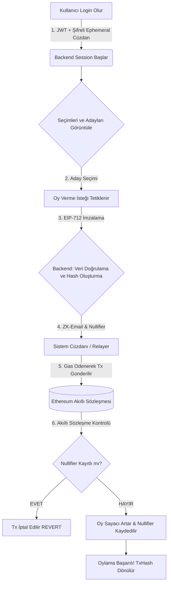

<div align="center">
  <h1>🗳️ SSI Voting - Blockchain Tabnlı Anonim Oylama Sistemi</h1>
  <p><strong>TÜBİTAK 2209-A Araştırma Projesi Kapsamında Geliştirilmiş, Sıfır Bilgi İspatı (Zero-Knowledge) ve Self-Sovereign Identity (SSI) Destekli Yeni Nesil Oylama Altyapısı</strong></p>
  
  [](https://nodejs.org/)
  [](https://reactjs.org/)
  [](https://soliditylang.org/)
  [](https://docs.ethers.io/)
  [](https://sqlite.org/)
  
</div>

---

## 📖 Proje Hakkında

Geleneksel elektronik oylama sistemlerinin şeffaflık ve manipülasyon sorunlarına karşın tasarlanan bu proje, **Ethereum Akıllı Sözleşmeleri**, **ZK-Email Konsepti** ve **Self-Sovereign Identity (SSI)** altyapılarını kullanarak geliştirilmiştir.

Sistem, seçmenlerin kimliğini tamamen gizli tutarken (anonimlik), kullanılan her oyun sadece bir kez kullanıldığı (çift oy engeli) ve değiştirilemeyeceği (değişmezlik) prensipleriyle çalışır. Harici bir **MetaMask veya Kripto Cüzdanına ihtiyaç duymadan**, Web2 rahatlığında Web3 güvenliği sağlar.

---

## 🌟 Öne Çıkan Özellikler & Nasıl Çalışır? (Features Deep-Dive)

Sistemin her bir yapı taşı, güvenlik ve kullanıcı deneyimi gözetilerek özel olarak tasarlanmıştır.

### 1. 🎭 ZK-Email & Nullifier Mekanizması (Tam Anonimlik)
- **Nasıl Çalışır?** Kullanıcı sisteme kurumsal e-posta adresiyle kayıt olur. Kullanıcı oy kullanırken e-posta bilgisi doğrudan blockchain'e gönderilmez. Bunun yerine, e-posta adresi, arka planda kriptografik olarak hashlenir ve seçim ile birleştirilerek tekil bir **Nullifier** (Gizli Kimlik Özeti) oluşturulur `keccak256(idHash + electionId)`.
- **Faydası:** Blockchain üzerindeki işlemler incelense bile, oyun kime ait olduğu (e-posta veya isim) asla geriye dönük olarak tespit edilemez. Çift oy kullanmaya çalışan bir kişinin "Nullifier"ı zaten kayıtlı olacağından sistem oyu otomatik reddeder.

### 2. ⛽ Walletless Oylama & Relayer Servisi (Gasless Oylama)
- **Nasıl Çalışır?** Kullanıcılar (seçmenler) kripto para piyasasından veya cüzdan konfigürasyonlarından (Gas ücreti, Metamask kurulumu vb.) tamamen izoledir. Kullanıcı giriş yaptığında (Login) arka planda geçici, şifrelenmiş bir **Session Wallet** (Oturum Cüzdanı) oluşturulur.
- **Faydası:** Kullanıcı oylama butonuna bastığında, işlem sistemin merkezi bir **Relayer** (Aktarıcı) servisi aracılığıyla kullanıcı adına ödemesi yapılarak blockchain'e yazılır. Seçmenin hiçbir kripto bilgisi olması gerekmez.

### 3. ✍️ EIP-712 Typed Data Stardardı
- **Nasıl Çalışır?** Oylama işlemi için standart veri paketleri yerine, doğrulanabilir ve kriptografik olarak yapılandırılmış bir "Oy İmza Paketi" (Credential ve Oy Dağılımı) oluşturulur.
- **Faydası:** Backend'in, kullanıcının niyetini (hangi adaya oy verdiğini) manipüle etmesini engeller. Akıllı Sözleşme, atılan imzanın tam ve kesin olarak o kişiye ait olduğunu EIP-712 standardında test ederek doğrular.

### 4. 🛡️ Geçici Oturum Cüzdanları (Ephemeral Wallets)
- **Nasıl Çalışır?** Her başarılı kullanıcı girişinde bellekte rastgele bir cüzdan (Private Key) oluşturulur, AES-256 algoritmasıyla şifrelenir ve oturum süresince saklanır. Çıkış yapıldığında (Logout veya Timeout) cüzdan tamamen yok edilir.
- **Faydası:** Cihaz çalınsa veya hacklense dahi veritabanında kullanıcının kalıcı bir cüzdanı bulunmadığı için geriye dönük oy sızıntısı riski ortadan kaldırılır.

---

## 🛠️ Yönetim ve Admin Paneli

Oylama sisteminin yönetimi, kullanımı kolay gelişmiş araçlarla desteklenmiş eşzamanlı bir kontrol paneli üzerinden yapılır:
* **Canlı Monitör:** Sisteme atılan oylar, blockchain blok onayları ve aktif seçimler gerçek zamanlı (%100 Live) izlenir.
* **Akıllı Seçim ve Aday Yönetimi:** Özel domain bazlı seçim kısıtları tanımlanabilir (Örn: *Sadece "@akdeniz.edu.tr" uzantılı kişiler oy kullanabilir*).
* **Blockchain Node Takibi:** Hardhat çalışma durumu, Contract adresleri, mevcut gaz kullanım oranları tek ekrandan gözlenir.

---

## 🏗️ Sistem Mimarisi & Oylama İş Akışı (Workflow)



1. **Autentikasyon Phase:** Kullanıcı giriş yapar, Backend kullanıcıyı yetkilendirir ve oturum oluşturur.
2. **Retrieve Phase:** Kullanıcının görmeye yetkili olduğu (domain filtresine uygun) aktif seçimler frontend'e gönderilir.
3. **Voting Phase:** E-posta verisi kullanarak özel bir SSI Credential'ı JSON olarak hazırlanır ve geçici cüzdan ile imzalanıp Relayer'a verilir.
4. **On-Chain Phase:** Smart contract, imzayı denetler; kimlik ve Nullifier temiz ise `vote()` fonksiyonunu işletir.

---

## 💻 Teknoloji Yığıtı (Tech Stack)

| Bileşen | Kullanılan Teknoloji | Görevi / Rolü |
|---------|----------------------|---------------|
| **Frontend** | React 18, Chart.js, Tailwind/CS | Etkileşimli Kullanıcı ve Aday Seçim Arayüzü |
| **Backend** | Node.js, Express.js | API Yönetimi, Oturum işlemleri ve Relayer Servisi |
| **Veritabanı** | SQLite (better-sqlite3) | Hızlı, gömülü ve ilişkisel data yönetimi |
| **Blockchain** | Solidity, Hardhat, Ethers.js v6 | Oyların barındırıldığı şeffaf Akıllı Sözleşmeler |
| **Kriptografi** | keccak256, bcrypt, AES-256-CBC | Kimlik ve ZK veri bütünlüğü güvenliği |

---

## 🚀 Yerel Ortamda Kurulum ve Çalıştırma

Projeyi bilgisayarınızda çalıştırmak oldukça basittir. Node.js (v16+) ve git yüklü olduğundan emin olun.

### 1. Repoyu Klonlayın ve Bağımlılıkları Yükleyin

```bash
git clone https://github.com/yourusername/OnlineVoting.git
cd OnlineVoting

# Ana dizin bağımlılıkları (Backend)
npm install

# İstemci (Frontend) bağımlılıkları
cd client && npm install && cd ..

# Blockchain (Smart Contract) bağımlılıkları
cd smart-contracts && npm install && cd ..
```

### 2. Ortam Değişkenleri (Environment Config)

Ana dizinde `.env` isimli yeni bir dosya oluşturun ve içerisine aşağıdaki değişkenleri yapıştırın:

```env
# Admin/Deployer Private Key (Hardhat Test Account #0)
ADMIN_PRIVATE_KEY=0xac0974bec39a17e36ba4a6b4d238ff944bacb478cbed5efcae784d7bf4f2ff80

BLOCKCHAIN_RPC_URL=http://127.0.0.1:8545
CHAIN_ID=31337
PORT=5000
SESSION_TIMEOUT=28800000
SESSION_SECRET=local_development_secret_key_1234
CORS_ORIGINS=http://localhost:3000,http://localhost:5000
```

### 3. Sistemi Başlatma Süreci

Uygulamanın farklı katmanlarını başlatmak için 3 ayrı terminal penceresi açmalısınız:

**Terminal 1 (Blockchain Test Ağı):**
```bash
cd smart-contracts
npx hardhat node
```

**Terminal 2 (Sözleşmeleri Dağıtma ve Backend'i Başlatma):**  
*(Sadece ilk seferde contract dağıtılır)*
```bash
cd smart-contracts
npx hardhat run scripts/deploy.js --network localhost
cd ..
node server.js
```

**Terminal 3 (Frontend İstemcisi):**
```bash
cd client
npm start
```
*Frontend adresi:* `http://localhost:3000`  
*Admin Paneli adresi:* `http://localhost:5000/admin.html`

---

## 📈 Proje Durumu / Sürüm Notları (Mart 2026)
* 🚀 Karmaşık `SSIVoting` akışı sadeleştirilerek tamamen `SimpleVoting` komponentinin kararlılığı sağlandı.
* 🧹 Kullanılmayan legacy SSI API endpointleri tamamen temizlendi, sistem `vote()` fonksiyonuna yönlendirildi.
* 📊 `?electionId` query yapısı ile seçimlere özel anlık durum getirme mekanizması geliştirildi.
* 🔐 Admin kullanıcı oluşumu standardize edildi.

---

<p align="center">
  <i>Bu proje <b>TÜBİTAK 2209-A</b> araştırma programı tarafından desteklenmiş olup, eğitim ve akademik araştırma bağlamında, blockchain'in anonim kimliklendirme sistemleri üzerindeki kullanılabilirliğini incelemek vizyonuyla hazırlanmıştır. 🎓</i>
</p>
